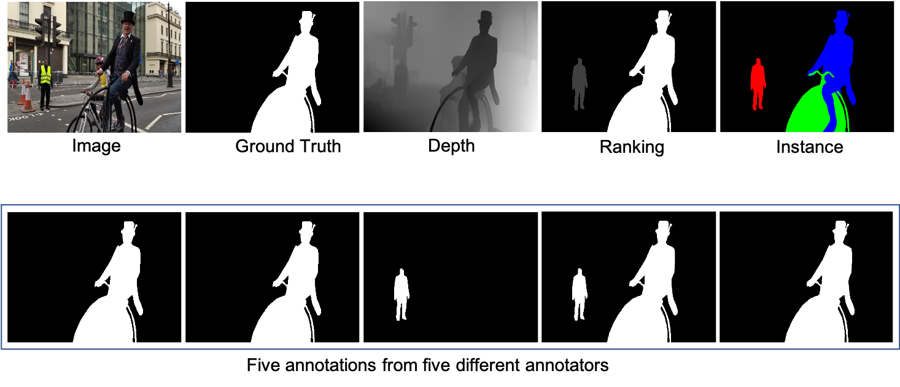

# Cascaded RGB-D SOD with COME15K dataset (ICCV2021)
This is the official implementaion of CLNet paper "RGB-D Saliency Detection via Cascaded Mutual Information Minimization".


# COME15K RGB-D SOD Dataset
We provide the COME training dataset, which include 8,025 image pairs of RGB-D images for SOD training. The dataset can be found at:
https://drive.google.com/drive/folders/1mGbFKlIJNeW0m7hE-1dGX0b2gcxSMXjB?usp=sharing

We further introduce two sets of testing dataset, namely COME-E and COME-H, which include 4,600 and 3,000 image pairs respectively, and can be downloaded at:
https://drive.google.com/drive/folders/1w0M9YmYBzkMLijy_Blg6RMRshSvPZju-?usp=sharing

训练数据百度网盘：
链接:https://pan.baidu.com/s/15vaAkGuLVYPGuuYujDuhXg  密码:m2er

测试数据百度网盘：
链接:https://pan.baidu.com/s/1Ohidx48adju5gMI_hkGzug  密码:dofk

# Rich Annotations


For both the new training and testing dataset, we provide binary ground truth annotations, instance level annotations, saliency ranking (0,1,2,3,4, where 4 indicates the most salient instance). We also provide the raw annotations of five different annotators. In this way, each image will have five binary saliency annotations from five different annotators.

# New benchmark
With our new training dataset, we re-train existing RGB-D SOD models, and test on ten benchmark testing dataset, including: SSB (STERE), DES, NLPR, NJU2K, LFSD, SIP, DUT-RGBD, RedWeb-S and our COME-E and COME-H. Please find saliency maps of retained models at (constantly updating):
https://drive.google.com/drive/folders/1lCE8OHeqNdjhE4--yR0FFib2C5DBTgwn?usp=sharing

# Retrain existing models
We retrain state-of-the-art RGB-D SOD models with our new training dataset, and the re-trained models can be found at:
https://drive.google.com/drive/folders/18Tqsn3yYoYO9HH8ZNVhHOTrJ7-UWPAZs?usp=sharing

# Our trained model on conventional training dataset (the combination of NLPR and NJU2K data) and the produced saliency maps on SSB (STERE), DES, NLPR, NJU2K, LFSD, SIP:

model: https://drive.google.com/file/d/1gUubs1eGr2fnrlgze-EFhD9XbghfAyhK/view?usp=share_link

maps: https://drive.google.com/file/d/1OPTc7NsGQq9uYBdfquLIbluMikWezYO8/view?usp=share_link

Note that, due to being stochastic, the model can perform slightly different each time of training. 
Solutions to get deterministic models:
1) instead of using the reparameterization trick as we used, you can simply follow the auto-encoder learning pipeline, and map features directly to the embedding space;--- to achieve this, you will need to remove the variance mapping function;
2) or you can simply define variance as 0, leading to deterministic generatration of the latent code, which is practice easier to implement.

# Our Bib:

Please cite our paper if necessary:
```
@inproceedings{cascaded_rgbd_sod,
  title={RGB-D Saliency Detection via Cascaded Mutual Information Minimization},
  author={Zhang, Jing and Fan, Deng-Ping and Dai, Yuchao and Yu, Xin and Zhong, Yiran and Barnes, Nick and Shao, Ling},
  booktitle={International Conference on Computer Vision (ICCV)},
  year={2021}
}
```
# Copyright
<a rel="license" href="http://creativecommons.org/licenses/by-nc-sa/3.0/"></a><br />This work is licensed under a <a rel="license" href="http://creativecommons.org/licenses/by-nc-sa/3.0/">Creative Commons Attribution-NonCommercial-ShareAlike 3.0 Unported License</a>.

# Privacy
This dataset is made available for academic use only. If you find yourself or personal belongings in this dataset and feel unwell about it, please contact us and we will immediately remove the respective data.

# Contact

Please drop me an email for further problems or discussion: zjnwpu@gmail.com
